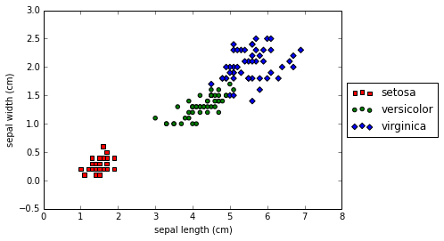
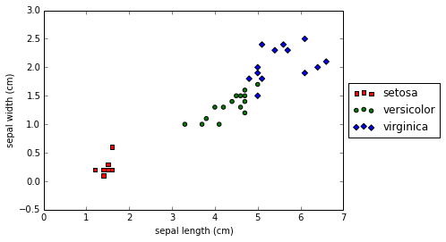
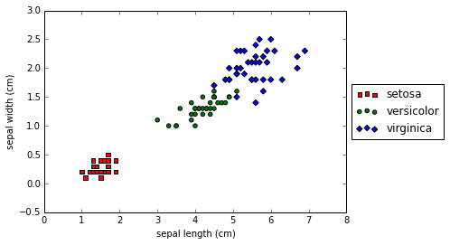
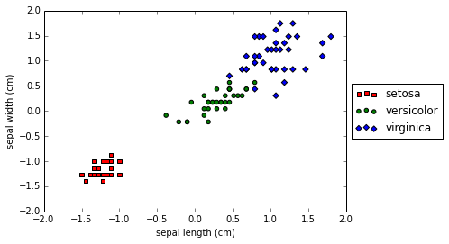
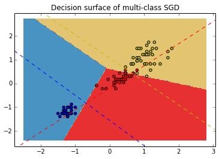

    %matplotlib inline
    from sklearn.datasets import load_iris
    from sklearn.cross_validation import train_test_split
    from sklearn.preprocessing import StandardScaler
    from pandas.tools.plotting import scatter_matrix, Series
    import pandas as pd
    import numpy as np
    import matplotlib.pyplot as plt
    from sklearn.linear_model import SGDClassifier
    from sklearn import metrics
    from sklearn.metrics import classification_report, confusion_matrix
    from sklearn.pipeline import Pipeline

    def representacion_grafica(datos,caracteristicas, objetivo, clases, c1, c2):
    
        for tipo,marca,color in zip(range(len(clases)),"soD","rgb"):
    
            plt.scatter(datos[objetivo == tipo,c1],
                        datos[objetivo == tipo,c2],
                        marker=marca,c=color)
    
        plt.ylabel(caracteristicas[c2])
        plt.xlabel(caracteristicas[c1])
        plt.legend(clases,loc='center left', bbox_to_anchor=(1, 0.5))
       
        

    iris = load_iris()
    
    X_iris, y_iris = iris.data, iris.target
    X_names, y_names = iris.feature_names, iris.target_names
    X_names

    ['sepal length (cm)',
     'sepal width (cm)',
     'petal length (cm)',
     'petal width (cm)']

    X_iris =  np.delete(X_iris, np.s_[X_names.index('sepal length (cm)'),X_names.index('sepal width (cm)')], axis=1)    
    X_names = ['petal length (cm)','petal width (cm)']
    X_names

    ['petal length (cm)', 'petal width (cm)']

    representacion_grafica(X_iris, iris.feature_names, y_iris, iris.target_names, 
                           X_names.index('petal length (cm)'), 
                           X_names.index('petal width (cm)'))

    X_train, X_test, y_train, y_test = train_test_split(X_iris,y_iris,test_size = 0.25)
    representacion_grafica(X_test, iris.feature_names, y_test, iris.target_names, 
                           X_names.index('petal length (cm)'), 
                           X_names.index('petal width (cm)'))

    representacion_grafica(X_train, iris.feature_names, y_train, iris.target_names, 
                           X_names.index('petal length (cm)'), 
                           X_names.index('petal width (cm)'))

    normalizador = StandardScaler().fit(X_train)
    Xn_train = normalizador.transform(X_train)
    Xn_test = normalizador.transform(X_test)
    representacion_grafica(Xn_train, iris.feature_names, y_train, iris.target_names, 
                           X_names.index('petal length (cm)'), 
                           X_names.index('petal width (cm)'))

    clasificador = SGDClassifier().fit(Xn_train,y_train)
    clasificador.coef_

    array([[ -6.53442679,  -6.14904876],
           [ 13.29340434, -14.26040053],
           [ 25.6661506 ,  26.01174949]])

    clasificador.intercept_

    array([ -9.59232234,  -2.64985382, -27.89876328])

    X = Xn_train  # we only take the first two features. We could
                          # avoid this ugly slicing by using a two-dim dataset
    y = y_train
    colors = "bry"
    
    # shuffle
    idx = np.arange(X.shape[0])
    np.random.seed(13)
    np.random.shuffle(idx)
    X = X[idx]
    y = y[idx]
    
    # standardize
    mean = X.mean(axis=0)
    std = X.std(axis=0)
    X = (X - mean) / std
    
    h = .02  # step size in the mesh
    
    # create a mesh to plot in
    x_min, x_max = Xn_train[:, 0].min() - 1, Xn_train[:, 0].max() + 1
    y_min, y_max = Xn_train[:, 1].min() - 1, Xn_train[:, 1].max() + 1
    xx, yy = np.meshgrid(np.arange(x_min, x_max, h),
                         np.arange(y_min, y_max, h))
    
    # Plot the decision boundary. For that, we will assign a color to each
    # point in the mesh [x_min, m_max]x[y_min, y_max].
    Z = clasificador.predict(np.c_[xx.ravel(), yy.ravel()])
    # Put the result into a color plot
    Z = Z.reshape(xx.shape)
    cs = plt.contourf(xx, yy, Z, cmap=plt.cm.Paired)
    plt.axis('tight')
    
    # Plot also the training points
    for i, color in zip(clasificador.classes_, colors):
        idx = np.where(y == i)
        plt.scatter(X[idx, 0], X[idx, 1], c=color, label=iris.target_names[i],
                    cmap=plt.cm.Paired)
    plt.title("Decision surface of multi-class SGD")
    plt.axis('tight')
    
    xmin, xmax = plt.xlim()
    ymin, ymax = plt.ylim()
    coef = clasificador.coef_
    intercept = clasificador.intercept_
    
    colors = "bry"
    def plot_hyperplane(c, color):
        def line(x0):
            return (-(x0 * coef[c, 0]) - intercept[c]) / coef[c, 1]
    
        plt.plot([xmin, xmax], [line(xmin), line(xmax)],
                 ls="--", color=color)
        
    for i, color in zip(clasificador.classes_, colors):
        plot_hyperplane(i, color)

    y_test_pred = clasificador.predict(normalizador.transform(X_test))

    metrics.accuracy_score(y_test,y_test_pred)

    0.94736842105263153

    print metrics.classification_report(y_test,y_test_pred)

                 precision    recall  f1-score   support
    
              0       1.00      1.00      1.00        10
              1       1.00      0.87      0.93        15
              2       0.87      1.00      0.93        13
    
    avg / total       0.95      0.95      0.95        38
    

    print metrics.confusion_matrix(y_test,y_test_pred)

    [[10  0  0]
     [ 0 13  2]
     [ 0  0 13]]

    modelo = Pipeline([ ('normalizador', StandardScaler()), ('modelolineal', SGDClassifier())])
    modelo.fit(X_train,y_train)
    y_test_pred = modelo.predict(X_test)
    print metrics.confusion_matrix(y_test,y_test_pred)

    [[10  0  0]
     [ 0 15  0]
     [ 0  3 10]]

    #CROSS VALIDATION
    #split the train data
    from sklearn.cross_validation import KFold
    kfold5 = KFold(X_train.shape[0], 5, shuffle = True)

    from sklearn.cross_validation import cross_val_score
    vals = cross_val_score(modelo, X_iris, y_iris, cv=kfold5)
    vals

    array([ 0.86956522,  0.91304348,  1.        ,  0.95454545,  0.86363636])

    np.mean(vals)

    0.92015810276679844

    import scipy
    
    #standard error 
    scipy.stats.sem(vals)

    0.02584780787896078

    #Obtaining predictions by cross-validation
    from sklearn import cross_validation
    predicted = cross_validation.cross_val_predict(modelo, X_iris,
                                                    y_iris, cv=5)
    metrics.accuracy_score(y_iris, predicted)

    0.92666666666666664

    
